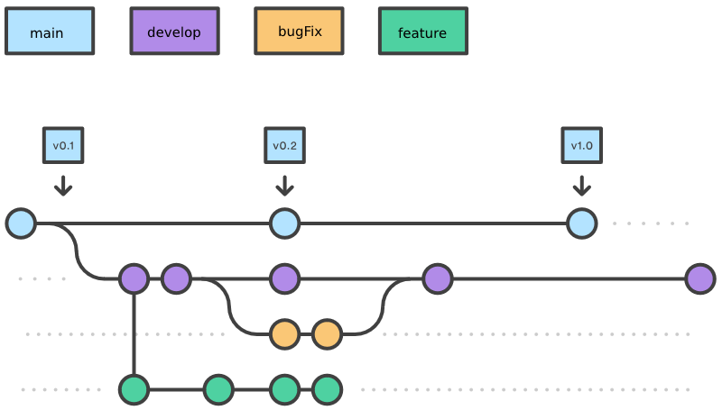

# Metodologia

Pré-requisitos: <a href="2-Especificação do Projeto.md"> Documentação de Especificação</a>

A metodologia de trabalho que a equipe adotou com o objetivo de atacar o problema foi a utilização do método SCRUM e KANBAN: 

O método Scrum agrega mais produtividade aos processos, além de permitir que a equipe identifique e corrija desafios de forma ágil e orientada à resolução de problemas, mesmo que estes venham a surgir durante o processo de desenvolvimento.

O método KANBAN é bastante flexível e atende aos sistemas que possuem muitos requisitos de alterações. Além de permitir uma visualização melhor do trabalho e limitação das atividades em andamento, o KANBAN possibilita que toda a equipe seja responsável pela tomada de decisões num mecanismo de controle, que garante um acompanhamento e uma constante atualização entre os envolvidos.

  

## Controle de Versão

O projeto utiliza um design de fluxo de trabalho baseado  no  [Gitflow Workflow](https://www.atlassian.com/br/git/tutorials/comparing-workflows/gitflow-workflow), mostrado na Figura a seguir:
  

    

<em>Fluxo de controle do código fonte no repositório</em>

 

Seguindo a seguinte convenção para o nome de branchs:

- `main`: versão estável já testada do software
- `develop`: versão de desenvolvimento e teste do software
- `bugfix`: uma funcionalidade encontra-se com problemas
- `feature`: introduzir uma nova funcionalidade

A cada sprint uma branch develop será criada a partir da main, que contém a versão estável. 

Para incluir uma nova funcionalidade o desenvolvedor deve criar uma branch feature a partir da branch develop criada para aquela sprint e ao finalizar o desenvolvimento, com os devidos testes realizados, solicitar o Pull Request para a branch develop e o code review de algum outro desenvolvedor da equipe. 

O desenvolvedor responsável pelo code review deve realizar o merge e testar a branch develop, caso encontre algum problema, deve abrir uma issue com a tag bug. 

O desenvolvedor responsável por corrigir o bug, deve criar uma branch bugFix a partir da develop e ao finalizar a correção, com os devidos testes realizados deve solicitar o Pull Request para a branch develop. 

Ao final da sprint a branch develop, devidamente testada será mesclada com a branch main e uma tag de versionamento será criada.

## Gerenciamento de Projeto

### Divisão de Papéis

Divisão de papéis entre os membros do grupo.

- Scrum Master: Amanda Salles Monteiro;
- Product Owner: Renê Boaventura Neto;
- Equipe de Desenvolvimento: Amanda Salles Monteiro, Gabriel Miranda Chaves, Icaro Yan Miranda, Larysse Gurgel de Oliveira, Renê Boaventura Neto, Suellen Batista Dias;
- Equipe de Design: Renê Boaventura Neto.

### Processo

Para dividir nossos processos vamos utilizar a metodologia Scrum.
Nossas sprints tem uma semana sendo a divisão das tarefas feitas no Sábado e baseada na entrega semanal ao cliente que deve ser feita geralmente na Quarta-feira às 18:30hs. 

[Link para o kanban](https://github.com/orgs/ICEI-PUC-Minas-PMV-ADS/projects/79/views/1)

#### Backlog
No início do nosso processo levantamos os requisitos necessários para a próxima entrega e colocamos no kanban do projeto na aba To Do para que cada integrante escolha suas tarefas. 

As tarefas, que são criadas como issues, devem estar devidamente descritas com todas as informações necessárias e com as etiquetas corretas.

Dentre as etiquetas temos: 

- `documentation`: tarefa relativa a documentação do trabalho
- `feature`: funcionalidade nova adicionada
- `enhancement`: melhoria de algo que já existe
- `bug`: problema encontrado
- `question`: informações precisam ser solicitadas para dar continuidade ao projeto

Para cada sprint é criado um milestone e todas as tarefas são atribuídas a ele de modo que possamos acompanhar o andamento da sprint até a data de entrega.

#### Desenvolvimento
Cada colaborador deve então escolher uma tarefa e movê-la para a aba In Progress. 

O desenvolvedor deve verificar se ele tem todas as informações e ferramentas necessárias para realizar a tarefa, assim como deve verificar se não há nenhuma coisa que impeça sua realização. 

Caso a tarefa seja de código, o desenvolvedor deve criar um branch para a tarefa e, quando finalizada e devidamente testada, solicitar que um colega revise. 

Caso seja uma tarefa de outro tipo, o realizador deve reportar sobre seu estado de progresso pelo grupo no teams. Este trabalho também deve passar por um processo de revisão. 

#### Revisão
Quando a tarefa estiver completa, ela deve ser movida para a aba de revisão. Quem estiver responsável por revisar deve, realizar testes, conferir se o código segue a norma culta e regras de ortografia e gramática da língua portuguesa, além de verificar se a tarefa foi de fato resolvida. 

Caso seja encontrado algum problema, o revisor deve retornar com a tarefa para a aba In Progress, comunicar ao desenvolvedor e solicitar a correção. 

#### Finalização

Quando pronto, o revisor tem a função de fechar a issue e mergear o branch criado com o branch estável. 

### Ferramentas

|Função    | Plataforma  | Link de Acesso |
|------|-----------------------------------------|----|
| Ferramenta de comunicação | Microsoft Teams| [teams.microsoft.com](https://teams.microsoft.com/)|
| Repositório | Github | [github/aluguel-de-bicicleta](https://github.com/ICEI-PUC-Minas-PMV-ADS/pmv-ads-2022-2-e4-proj-infra-t1-troca-comigo) |
| Organização de tarefas | Kanban Github| [github/projects](https://github.com/orgs/ICEI-PUC-Minas-PMV-ADS/projects/79/views/1)|
| Ferramente de criação dos diagramas do projeto | Draw.io Integration | [draw.io](https://app.diagrams.net/)| 
| Editor de código | Visual Studio Code| [visualstudio.com](https://code.visualstudio.com/)|

 

Com o intuito de economizar tempo e evitar o uso de múltiplas ferramentas com a mesma função, o grupo deu preferência para o uso das ferramentas já usadas e sugeridas pelo curso. 

Por isso, usamos a plataforma Teams para comunicação, apresentação e guardar documentos. Seguindo a mesma linha, mas também por ser uma ferramenta crucial no mercado de trabalho, decidimos pelo uso do Github tanto como repositório quanto como organizador de tarefas. 

O editor de código foi escolhido por ser gratuito, um dos mais populares para desenvolvimento front-end e possuir uma integração com o
sistema de versão. 

## Integração com ferramenta CI/CD

Para integração das etapas de desenvolvimento da solução Web API, e também para uma otimização de tempo e organização, o GitLab será agregado ao projeto.

O Gitlab é uma ferramenta que agrega diversas funcionalidades, mas, primordialmente, é um gerenciador de repositório baseado em Git, assim como o Github. Hoje em dia, além da funcionalidade citada, ele também conecta diversas ferramentas do mundo DevOps, assim como conceitos de CI/CD e até mesmo Kubernetes 

Para facilitar esse processo, o GitLab CI/CD surge como ferramenta integrada ao GitLab onde é possível descrever todos os passos de integração e implantação contínua em um arquivo dentro do repositório. Este arquivo é o .gitlab-ci.yml.

Trata-se de um arquivo no formato YAML onde são definidos estágios e tarefas para execução das etapas necessárias da integração e implantação contínua.

A primeira parte a se pensar são os estágios (stages) das tarefas (jobs). Os estágios são grupos de tarefas e são executados sequencialmente. São grupos de ações que precisam ser executadas para executar as verificações de código e por fim, a implantação.

  Fonte:https://blog.ateliedocodigo.com.br/do-zero-ao-primeiro-job-com-gitlab-ci-f9dcf6a183 

Em suma, o  Gitlab é fácil escalar os runners, há uma execução paralela de tarefas em diferentes fases do pipeline, com o gitlab, você pode contratar todos os aspectos do trabalho com repositórios git, incluindo branches com códigos.

#### Implementação e hospedagem do projeto

- Para criar nosso repositório, na página inicial clicamos no ícones Novo Projeto.

- Na próxima página, como o projeto já estava no repositório do git, clicamos na opção Import Project:

- Com o projeto importado, a integração com o CI/CD pôde ser iniciado.

## Reversão
Há maneiras de realizar reversão do que foi criado, sendo possível reverter commits pontuais ou até mesma a solução inteira. Para esse procedimento um novo commit é  gerado revertendo as ações realizadas no commit de origem.

Para fazer isso:

- Na barra superior á esquerda, clicar em Menu principal > Projetos e buscar pelo repositório.

- Na barra lateral  á esquerda, selecione a aba Merge Requests e identifique sua solicitação de mesclagem.

- Quando tiver um commit para reversão, ir até a área de relatórios de Merge Request e encontrar o commit de desejo.

- Em Reverter na branch, selecione a branch que você deseja reverter suas alterações.
- Selecionar Reverter.

