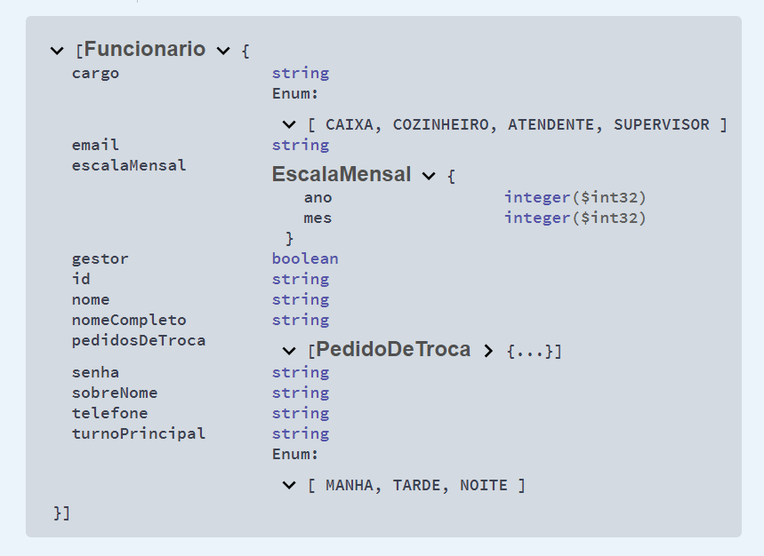
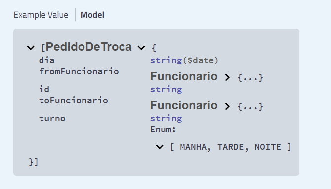

# Programação de Funcionalidades

Pré-requisitos: <a href="2-Especificação do Projeto.md"> Especificação do Projeto</a>, <a href="3-Projeto de Interface.md"> Projeto de Interface</a>, <a href="4-Metodologia.md"> Metodologia</a>, <a href="3-Projeto de Interface.md"> Projeto de Interface</a>, <a href="5-Arquitetura da Solução.md"> Arquitetura da Solução</a>

## Api

Escrita em Java, nossa Api utilizou SpringBoot, SpringBoot Starter Data para MongoDB e Lombok para definir as estruturas iniciais das entidades utilizadas no projeto. 

Foram criados os endpoints principais para disponibilizar o acesso às operações que 

podem ser realizadas por usuários registrados. 

A documentação do projeto e os JSON's que representam os dados armazenados na base de dados do projeto são gerados automaticamente graças ao uso da ferramenta Swagger.

Ambos podem ser acessados através dos seguintes endpoints: 

- /swagger-ui.html#/
- /v2/api-docs

### Endpoints e principais modelos da base de dados NOSQL

- /funcionarios

 

- /trocas
  
  

